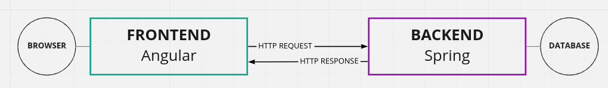
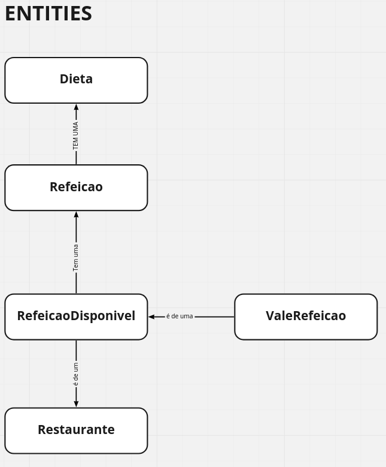
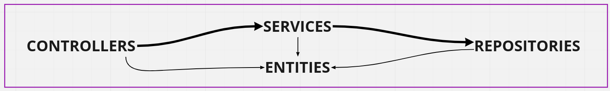
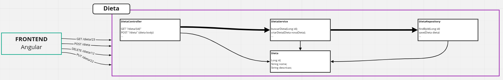
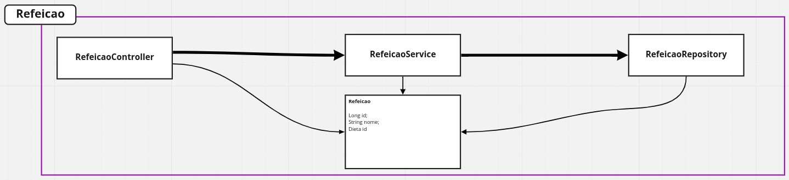
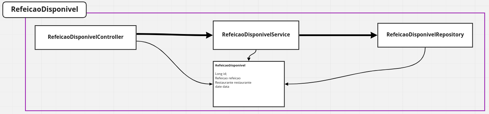
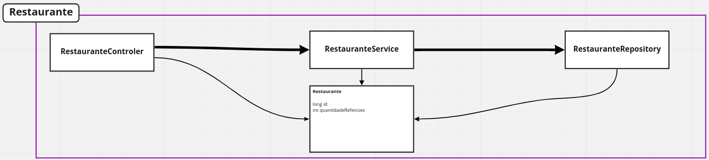
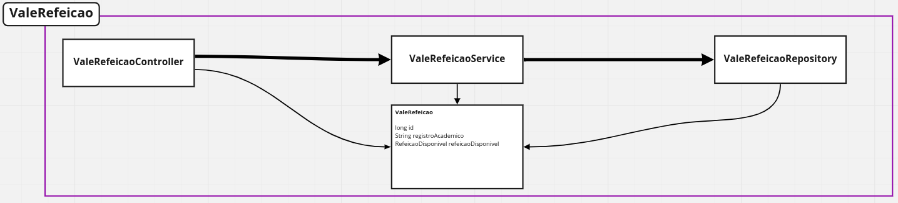

# Planejamento

### Problematica

Se faz necessária a venda semanal de refeições pela secretaria da universidade. O aluno apresenta seu registro academico (RA) para liberar a compra de um ou mais vale refeições (VR) do Restaurante universitário (RU) da semana subsequente. O pagamento é controlado pela secretaria na hora da compra do VR pelo aluno, que informa quais os dias da semana vai comprar os VR`s e qual será a sua dieta em cada refeição.

Por dia há um numero maximo de refeicões que o RU consegue produzir. As refeicoes sao divididas entre as dietas: onivora, vegetariana e vegana. A secretaria lança no sistema quais serão as refeições da semana subsequente segundo as orientações da nutricionista. O aluno tem acesso ao cardapio da semana seguinte. 

### Dicionário 

- **Refeição**: Comida oferecida pelo restaurante universitário nos dias uteis.
- **Secretaria**: Departamento da Universidade que cuida de serviços administrativos gerais.
- **Universidade**: Instituição de ensino que abrange várias escolas de nível superior, pós-graduação, mestrado, doutorado etc.
- **Aluno**: Estudante da Universidade em questão.
- **RA**: Número de identificação do estudante no sistema de cadastro da Secretaria da Universidade.
- **VR**: Comprovante de compra de uma refeição diária.
- **RU**: Restaurante que fornece alimento para os alunos da Universidade.
- **Dieta**: Regime alimentar prescrito por um nutricionista, com a privação total ou parcial de alguns alimentos específicos.
- **Nutricionista**: Especialista em nutricao do RU.
- **Cardápio**: Lista de refeiçoes por dia da semana.
- **Venda**: Uma refeição vendida para um dia da semana que esteja disponivel no cardapio

### Arquitetura

### Entidades

### API

